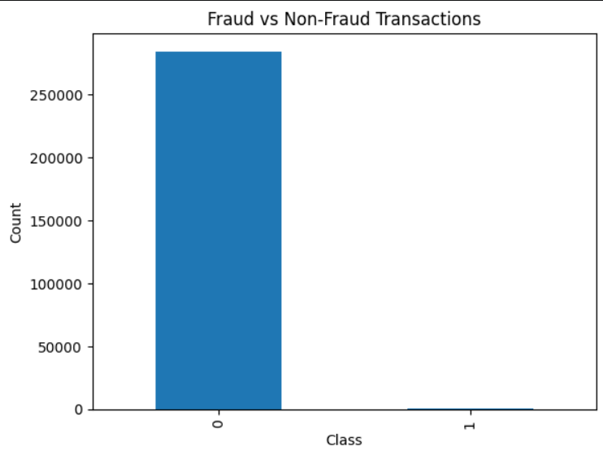
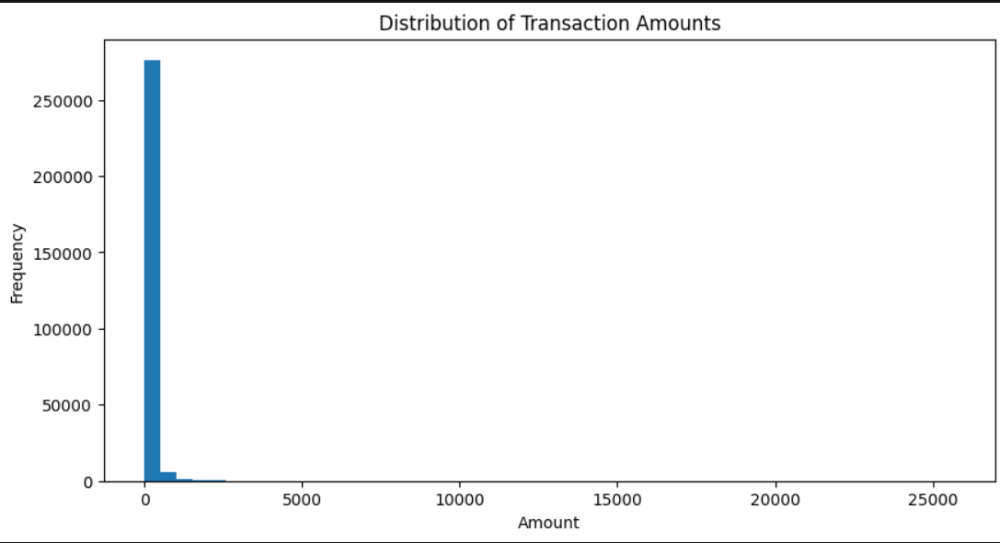
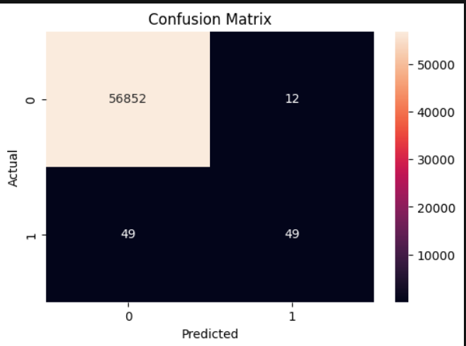

# Credit Card Fraud Detection

## Project Overview

This project uses Machine Learning to detect fraudulent credit card transactions. The dataset contains transactions made by European cardholders and is highly imbalanced, with fraud transactions representing a very small percentage of all transactions.

The objective of this project is to build a model that can accurately identify fraudulent transactions while minimizing false alarms.

## Dataset

The dataset contains:

* 284,807 transactions
* 492 fraudulent transactions
* 30 features used for prediction

Dataset source:
https://www.kaggle.com/datasets/mlg-ulb/creditcardfraud

## Technologies Used

* Python
* Pandas
* NumPy
* Matplotlib
* Seaborn
* Scikit-learn
* Jupyter Notebook

## Exploratory Data Analysis

The following analyses were performed:

* Fraud vs Non-Fraud transaction comparison
* Transaction amount distribution
* Fraud percentage calculation
* Statistical analysis of transaction amounts

## Machine Learning Model

Model Used:

* Random Forest Classifier

Performance:

* Precision: 97%
* Recall: 77%
* F1 Score: 86%

## Results

The Random Forest model successfully detected most fraudulent transactions while maintaining very high overall accuracy.

## Project Structure

CreditCardFraudDetection

├── Data

├── Images

├── Notebooks

├── reports

└── README.md

## Future Improvements

* Hyperparameter tuning
* Feature engineering
* Real-time fraud detection
* Deployment using Flask or Streamlit

## Author

Shriya Shankar

## Visualizations

### Fraud vs Non-Fraud Transactions

### Transaction Amount Distribution

### Confusion Matrix

